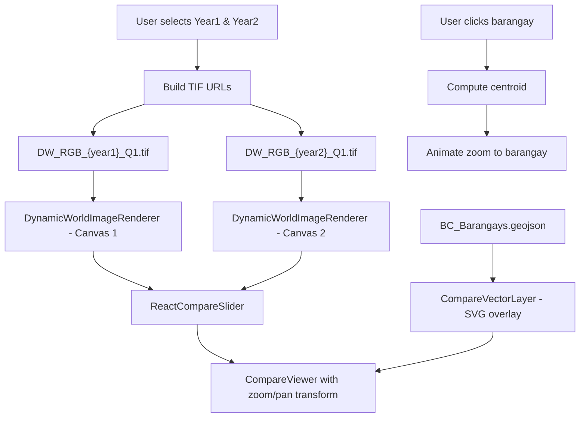

# LULC Image Comparison Slider — Implementation Plan

## Overview

A new `/compare` route that lets users compare **Dynamic World LULC images** across two selected years using a **draggable slider**. The barangay vector layer overlays both sides so users can click a barangay to zoom in and compare at the barangay level.

---

## Library Decision

### ✅ Recommended: `react-compare-slider`

| Criteria | `react-compare-slider` | `react-compare-image` | Custom build |
|---|---|---|---|
| Canvas support | ✅ Native — accepts any React node | ❌ img URLs only | ✅ Full control |
| Customizable handle | ✅ `ReactCompareSliderHandle` | ❌ Limited | ✅ Full control |
| Maintained | ✅ Active (last updated recently) | ⚠️ Stale | N/A |
| Effort | Low | N/A | High |
| Touch support | ✅ Built-in | ✅ Built-in | Must implement |

**Why:** It natively supports `<canvas>` elements as children (via `itemOne` / `itemTwo` props), has a customizable slider handle, supports touch/mouse, and is lightweight. Perfect fit since we render TIFFs to `<canvas>` via `geotiff.js`.

---

## Architecture

### Route & Navigation

```
src/app/(main)/compare/
├── page.tsx                    # Main compare page
├── _components/
│   ├── compare-viewer.tsx      # Core slider + canvas + vector overlay
│   ├── compare-controls.tsx    # Year selectors + zoom controls
│   └── compare-vector-layer.tsx # Adapted barangay boundaries (shared SVG overlay)
```

A new **"COMPARE"** tab will be added to `SharedHeader` alongside "SEGMENTATION MAP" and "DEEPAR FORECAST".

### Component Hierarchy

```
ComparePage
├── CompareControls          (year1/year2 selectors, zoom buttons, recenter)
└── CompareViewer
    ├── ReactCompareSlider
    │   ├── itemOne → DynamicWorldImageRenderer (year1)
    │   └── itemTwo → DynamicWorldImageRenderer (year2)
    └── CompareVectorLayer   (SVG overlay on top of the slider, z-index above both)
```

---

## Key Design Decisions

### 1. Slider Mechanics

The `ReactCompareSlider` clips `itemOne` and `itemTwo` using CSS clip-path. Both canvases render at the **same pixel dimensions** (matching the TIFF), so alignment is guaranteed.

```tsx
<ReactCompareSlider
  itemOne={<DynamicWorldImageRenderer url={year1Url} />}
  itemTwo={<DynamicWorldImageRenderer url={year2Url} />}
  handle={<ReactCompareSliderHandle />}  // customizable
/>
```

### 2. Barangay Vector Layer Overlay

The SVG vector layer must sit **on top** of the slider, covering both sides:

- Reuse the existing projection logic from `barangay-vector-layer.tsx` (`TIFF_METADATA`, GeoJSON → SVG path conversion)
- The SVG overlay matches the slider dimensions with `pointer-events: auto` for clicks, but `pointer-events: none` on the container so the slider handle remains draggable
- On barangay click → zoom into that area (same centroid calculation as existing)

> [!IMPORTANT]
> The SVG must be sized identically to the canvas outputs so paths align pixel-perfectly. Both use the same `TIFF_METADATA` (1008×823).

### 3. Zoom & Pan

Reuse the same zoom/pan pattern from `interactive-map.tsx`:
- Wrap the slider + vector overlay in a transformable container
- `transform: translate(x, y) scale(s)` for zoom/pan
- Mouse wheel zoom, drag to pan
- Zoom-to-barangay on click (compute centroid → animate zoom)

> [!WARNING]
> The slider handle drag and the pan drag **conflict** — both respond to mouse drag. We need to ensure:
> - **Horizontal drag on the handle area** → moves the slider
> - **Drag elsewhere** → pans the map
> 
> The `react-compare-slider` handle consumes its own events, so pan should only activate outside the handle zone. We may need to fine-tune `pointer-events` or use a modifier key (e.g., hold Ctrl to pan).

### 4. Year Selection

- Reuse the `BarangayCompareYearFilters` pattern (two Select dropdowns with "Base Year" / "Compare Year")
- Available years: derived from the DW image filenames (2016–2026)
- Default: year1 = 2016, year2 = 2026 (or latest)

### 5. Year Labels on Slider

Each side should show a floating year badge:
- Left side: `2016` badge pinned to top-left
- Right side: `2026` badge pinned to top-right
- These stay visible as the slider moves

---

## Step-by-Step Build Order

### Phase 1: Foundation
1. **Install** `react-compare-slider`
2. **Create** route structure: `src/app/(main)/compare/page.tsx`
3. **Add** "COMPARE" tab to `SharedHeader` (with an appropriate icon like `SplitSquareHorizontal` from lucide)

### Phase 2: Core Slider
4. **Create** `CompareViewer` component:
   - Two `DynamicWorldImageRenderer` instances (year1, year2)
   - Wrap in `ReactCompareSlider`
   - Year labels overlaid on each side
5. **Create** `CompareControls`:
   - Year1 / Year2 selectors
   - Zoom in/out buttons
   - Recenter button

### Phase 3: Vector Overlay
6. **Create** `CompareVectorLayer`:
   - Adapt from `barangay-vector-layer.tsx`
   - Overlay the SVG on the slider (full width/height, matching TIFF dims)
   - Click handler to zoom-to-barangay
   - Tooltip on hover

### Phase 4: Zoom & Pan
7. **Implement** zoom/pan on the compare viewer container
   - Scroll-wheel zoom
   - Drag-to-pan (avoiding conflict with slider handle)
   - Zoom-to-barangay on click
   - Recenter button

### Phase 5: Polish
8. **Loading states** — spinner while TIFFs decode
9. **Transitions** — smooth zoom animations
10. **Responsive** — ensure usable on smaller screens

---

## Data Flow



---

## Open Questions

1. **Slider handle style** — The reference image shows a circular handle with arrows. Should we match that exactly, or use the library's default handle (vertical line with grip dots)?

2. **Pan vs. slider conflict resolution** — Preferred approach:
   - **Option A**: Pan only when zoomed in (drag-to-pan enabled at scale > 1), slider works at all times
   - **Option B**: Hold a modifier key (e.g., Ctrl+drag) to pan
   - **Option C**: Dedicated pan mode toggle button
   
   Which do you prefer?

3. **Header tab behavior** — Unlike "DEEPAR FORECAST" which requires a selected barangay, "COMPARE" is city-wide. Should it always be accessible (no barangay prerequisite)?
